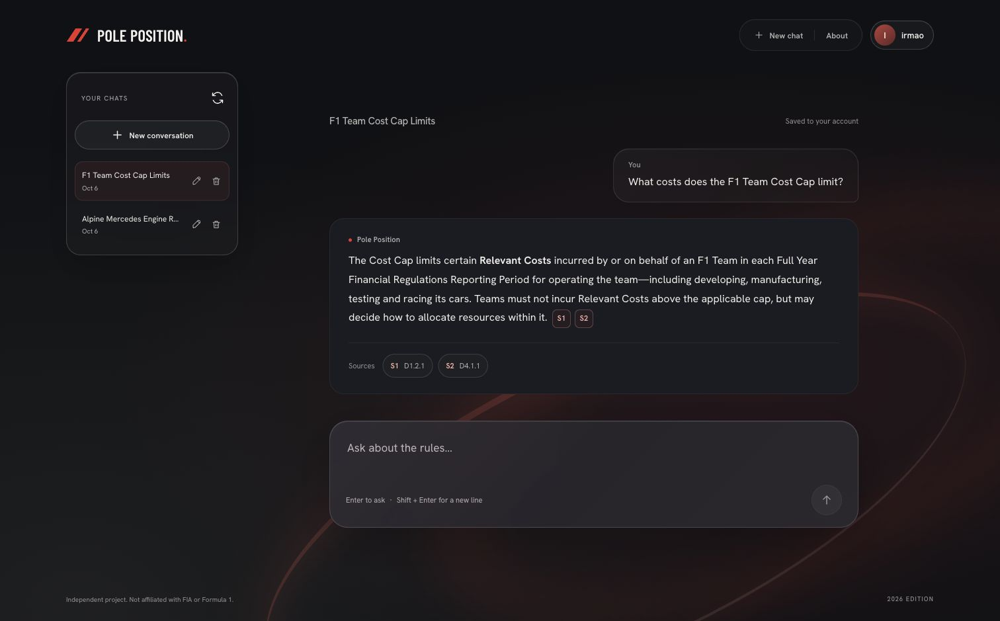
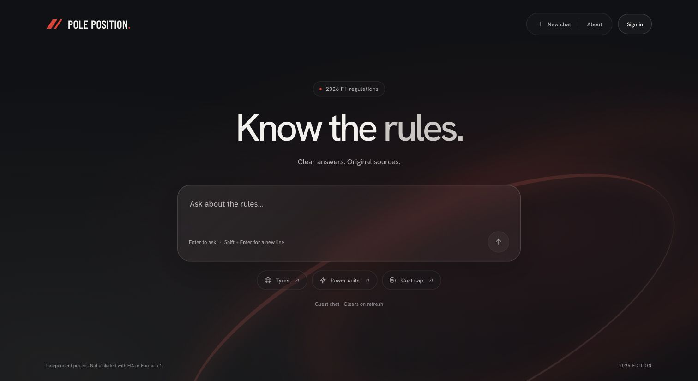
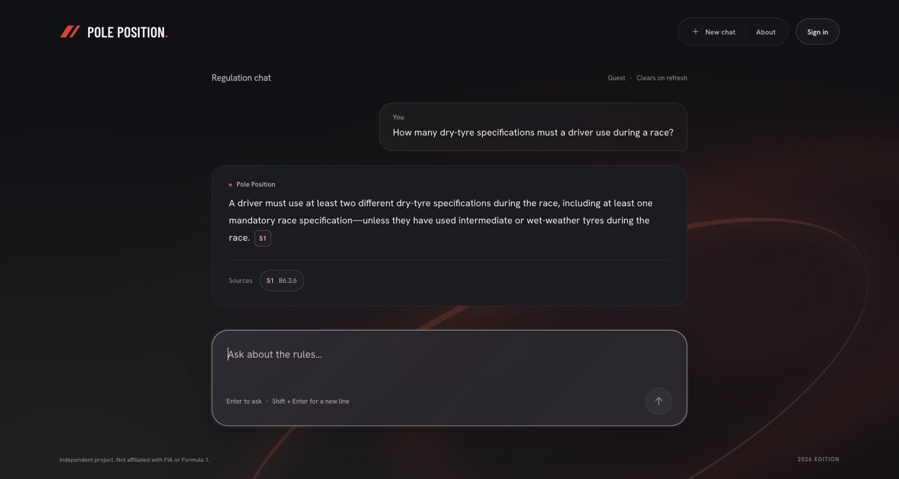
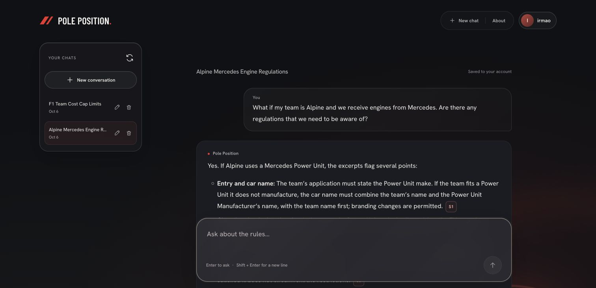
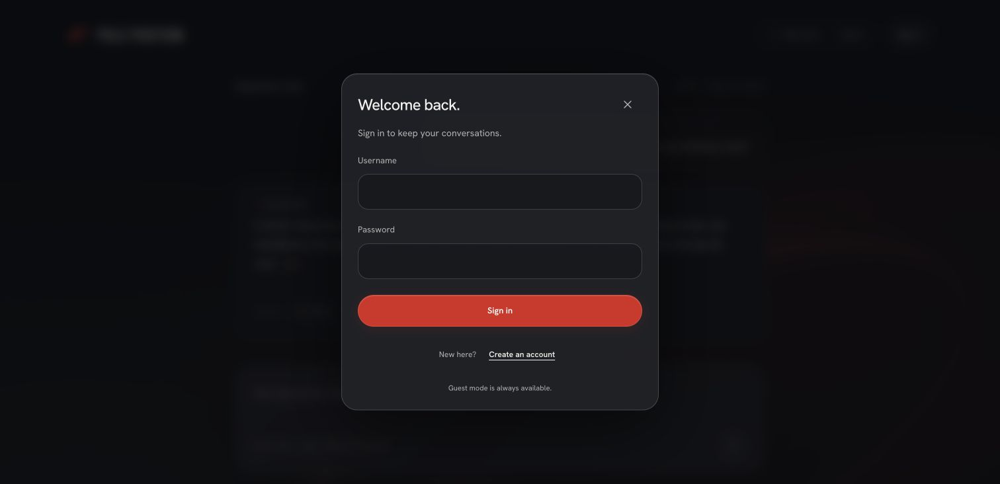
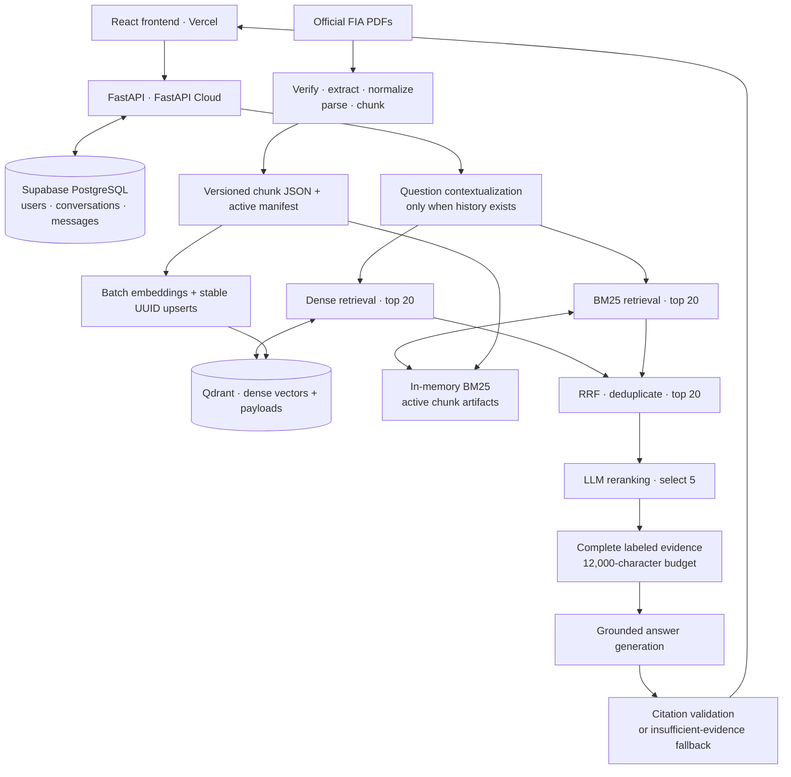

# Pole Position

> Citation-grounded AI chat for the 2026 FIA Formula One regulations.

[Live demo](https://f1-pole-position.vercel.app/) · [API documentation](https://pole-position.fastapicloud.dev/docs) · [Evaluation dataset](data/eval/questions.json) · [Measured results](docs/evaluation/retrieval-2026-10-05.json)

Ask about sporting, technical, financial, or operational rules, then inspect the passages behind the answer. Pole Position is an end-to-end RAG application: version-aware PDF ingestion, hybrid retrieval, LLM reranking, grounded generation, citation validation, and persistent conversations—not a general-purpose chatbot with an F1 prompt.



*A real production response. Inline source labels resolve to regulation references and PDF pages; signed-in conversations are saved automatically.*

The indexed snapshot contains **6 documents, 612 PDF pages, and 2,857 active chunks**. On a 40-question development evaluation, hybrid retrieval reached **98.6% mean Recall@5** across the 36 answerable questions, compared with **94.4% for dense retrieval**. These are source-retrieval scores, not answer-accuracy claims; the remaining red-flag retrieval gap is documented below.

**Stack:** Python 3.12 · FastAPI · Pydantic · OpenAI · Qdrant · BM25 · PostgreSQL / SQLAlchemy / Alembic · React · TypeScript · Vite · Supabase · FastAPI Cloud · Vercel

## Contents

- [What the product does](#what-the-product-does)
- [Screenshots](#screenshots)
- [Architecture](#architecture)
- [AI pipeline and design decisions](#ai-pipeline-and-design-decisions)
- [Evaluation and measured results](#evaluation-and-measured-results)
- [API behavior](#api-behavior)
- [Security and reliability](#security-and-reliability)
- [Run locally](#run-locally)
- [Tests](#tests)
- [Deployment and regulation updates](#deployment-and-regulation-updates)
- [Project structure](#project-structure)
- [Known limitations](#known-limitations)
- [Sources and licensing](#sources-and-licensing)

## What the product does

- Answers questions across all six regulation sections without requiring the user to choose a section.
- Combines semantic search with keyword search that preserves references such as `B8.2.8`.
- Returns clickable citations with the document, clause or appendix, PDF page, and complete retrieved excerpt.
- Supports follow-up questions by rewriting the latest question using recent conversation history.
- Lets guests chat without saving messages; signed-in users can reopen, rename, and delete their own conversations.
- Abstains when the available evidence is insufficient instead of inventing an unsupported rule.

This is an independent educational project, not an official FIA service or a substitute for reading the applicable regulations.

## Screenshots

Captured from the live application on **6 October 2026**, using real responses rather than seeded mock answers. The source drawer shows a retrieved passage, not the entire PDF.

### Welcome and guest chat



*Guest mode is available immediately; authentication is optional.*



*The answer preserves the intermediate/wet-weather exception and links to B6.3.6 in the indexed Sporting Regulations.*

### Inspectable evidence


*Each source label belongs to its own answer. The drawer exposes the passage and page, with a separate link to the official FIA regulation library.*

### Saved history and authentication



*Saved chats have compact generated titles. Reopening restores messages and their stored citation metadata; rename and delete controls remain separate actions.*



*The API owns username/password authentication. Supabase hosts PostgreSQL; Supabase Auth is not used.*

## Architecture



The offline ingestion/indexing path is separate from online chat. PostgreSQL stores application data, Qdrant stores embeddings and chunk payloads, and BM25 is built from local active-corpus artifacts. The frontend never receives database or model-provider credentials.

## AI pipeline and design decisions

### 1. Build a traceable corpus

[Ingestion](src/pole_position/rag/ingestion/) verifies source hashes and document metadata, extracts PDF text with PyMuPDF, normalizes it, and parses articles, clauses, appendices, and the preamble. Clause chunks are page-aware, with a default target of 1,200 **characters**, not tokens. Long text is split at paragraph, sentence, or word boundaries; citation provenance stays attached.

| Section | Indexed issue | PDF pages | Active chunks |
| --- | --- | ---: | ---: |
| A — General Regulatory Provisions | 03 | 84 | 376 |
| B — Sporting Regulations | 09 | 101 | 515 |
| C — Technical Regulations | 20 | 254 | 1,228 |
| D — Financial Regulations, F1 Teams | 08 | 64 | 342 |
| E — Financial Regulations, PU Manufacturers | 06 | 60 | 269 |
| F — Operational Regulations | 11 | 49 | 127 |
| **Total** | | **612** | **2,857** |

The [manifest](data/manifests/2026_f1_regulations.json) records the indexed editions and SHA-256 hashes. The corpus includes 2,424 clause chunks, 432 appendix chunks, and one preamble chunk. Future-year appendices and visual-only content are excluded explicitly rather than treated as searchable text.

### 2. Index for meaning and exact terminology

[Embeddings](src/pole_position/rag/indexing/embeddings.py) use OpenAI `text-embedding-3-small`, with 1,536-dimensional vectors in Qdrant's named `dense` vector using cosine distance. Embedding input includes the document and regulation reference alongside the text. Batches are validated for ordering, finite values, and consistent dimensions.

[Qdrant storage](src/pole_position/rag/indexing/qdrant_store.py) derives stable UUIDs from readable chunk IDs, preserving the original IDs and provenance in payloads. Rerunning an unchanged edition overwrites those points instead of duplicating them. An incompatible collection configuration raises an error; it is not deleted automatically.

[BM25](src/pole_position/rag/indexing/bm25_index.py) is a small in-memory inverted index over the same active chunks. Unicode normalization and tokenization retain dotted clause references. It uses term frequency, inverse document frequency, and document-length normalization (`k1=1.2`, `b=0.75`); it does not call an LLM or require a second vector database.

### 3. Retrieve, fuse, and rerank

The normal chat path retrieves 20 dense and 20 BM25 candidates, deduplicates them by chunk ID, and keeps 20 fused candidates. [Reciprocal Rank Fusion](src/pole_position/rag/retrieval/fusion.py) combines **ranks**, avoiding direct comparison between cosine and BM25 scores:

```python
# Each search list contributes once per chunk; rrf_k defaults to 60.
candidate.fusion_score += 1 / (rrf_k + rank)
```

Dense retrieval is restricted to the active document IDs from the same corpus snapshot used by BM25:

```python
document_ids=tuple(sparse_corpus.document_titles)
```

This prevents retained, superseded editions from competing with the active corpus. An optional section filter is also available internally.

The [reranker](src/pole_position/rag/retrieval/reranker.py) judges candidate usefulness against the question, including conditions and exceptions. It returns a structured ordering whose indices must form a valid permutation of the supplied candidates. Production selects five; a reranking failure falls back to the fused top five.

### 4. Resolve follow-ups without treating chat as evidence

The [query contextualizer](src/pole_position/rag/retrieval/query_contextualizer.py) uses at most the latest ten messages to produce a standalone question. No history means no contextualization call. History resolves references such as “that requirement”; only retrieved regulation passages support the final answer.

Guests send recent history from browser memory. Authenticated requests use server-owned conversation history, with ownership checked before retrieval. The complete saved conversation remains accessible even though contextualization uses a bounded window.

### 5. Generate within an evidence boundary

[Context building](src/pole_position/rag/generation/context_builder.py) assigns labels such as `[S1]`, deduplicates chunks, and includes complete excerpts within a 12,000-character budget. It skips an excerpt that does not fit rather than cutting a cited passage mid-rule. This is a character-based size guard, not exact token accounting.

The [answer prompt](src/pole_position/rag/generation/prompts.py) instructs the model to use the supplied evidence, preserve exceptions, treat user/excerpt instructions as untrusted, and abstain when support is missing.

### 6. Validate citations before returning an answer

The [validator](src/pole_position/rag/generation/citations.py) checks that source markers reference actual context sources. Unknown, malformed, or missing citations are rejected; valid labels are mapped back to their chunk metadata. Invalid output is replaced with the fixed insufficient-evidence response:

```python
try:
    return validate_citations(draft, context)
except CitationValidationError:
    return validate_citations(INSUFFICIENT_EVIDENCE_ANSWER, context)
```

This validates **source identity and citation syntax**, not whether every claim is semantically entailed by its source. That distinction matters when interpreting the evaluation.

### Model configuration

The recorded evaluation uses `text-embedding-3-small` for embeddings and `gpt-6-luna` for contextualization/reranking. The application configures `ANSWER_MODEL=gpt-6-luna` for generation and its lightweight text tasks, with `RERANK_ENABLED=true`. These are configured model names, not immutable snapshot guarantees. There is no published model-choice ablation; the measured comparison is between retrieval pipelines using the same configuration.

## Evaluation and measured results

The [evaluation runner](src/pole_position/rag/evaluation/runner.py) compares dense, hybrid, and hybrid-reranked retrieval on the same question and active corpus, without using expected sources as section filters. [The dataset](data/eval/questions.json) contains 40 authored cases: 36 answerable and four unanswerable, spanning exact lookup, semantic, numerical, terminology, cross-document, and follow-up questions.

Gold source labels include document edition, clause/appendix or preamble, and PDF page. Expected answer facts support manual review; the script does **not** generate or judge final answers.

### Recorded run — 5 October 2026

| Retrieval method | Mean Recall@5 | Mean Recall@10 | MRR@10 |
| --- | ---: | ---: | ---: |
| Dense | 0.9444 | 0.9444 | 0.9190 |
| Dense + BM25 + RRF | 0.9861 | 0.9861 | 0.9292 |
| Hybrid + LLM reranking | 0.9861 | 0.9861 | 1.0000 |

[Metrics-only evidence](docs/evaluation/retrieval-2026-10-05.json) includes per-case results, model/configuration, timestamps, and dataset/manifest hashes. Full local reports also contain ranked chunks; those reports are not committed to avoid redistributing bulk extracted PDF text.

- **Recall@k** measures the fraction of expected source targets found among the first k chunks, averaged per question.
- **MRR@10** measures how early the first expected source appears. A score of 1.0 does not mean every required source was retrieved or every answer was correct.
- The four unanswerable cases have no gold retrieval target and are excluded from these averages.
- Evaluation retains the reordered candidate pool for Recall@10; live chat selects only five candidates before context construction.

Hybrid improved mean Recall@5 by about **4.2 percentage points** in this run. It recovered an aerodynamic-testing terminology case missed by dense retrieval and both sources for a cross-document cost-cap comparison. Reranking improved first-relevant-source placement, but did not recover evidence absent from the candidate pool.

### A failure worth keeping visible

`sporting_red_flag_tyres_001` requires both the suspension rule (`B5.14.4`, PDF page 49) and the dry-tyre requirement (`B6.3.6`, PDF page 59). All three methods retrieved only one of those expected sources within the top ten: recall was **0.5**, despite reciprocal rank being **1.0**. A manually checked generated answer abstained. That is safer than fabrication, but still an incomplete result for an answerable question.

Manual smoke checks also produced supported two-document cost-cap answers and empty-citation abstentions for all four out-of-corpus questions: championship results, a driver's salary, confidential car-design data, and a user's home address. These checks are not a comprehensive generation benchmark.

The dataset is small and development-authored; some questions explicitly name clauses. There is no independent held-out test set or confidence interval. Reported scores characterize this snapshot, not all possible F1 questions. Per-request p50/p95 latency and token/cost telemetry are not yet measured. The recorded **303.654 seconds** is total evaluation runtime, not chat latency.

Reproduce a small run, then the full comparison:

```sh
uv run python scripts/evaluate_retrieval.py --limit 5
uv run python scripts/evaluate_retrieval.py
uv run python scripts/debug_retrieval.py --rerank "What happens if a driver exceeds the permitted power unit element allocation?"
```

These commands require the matching local corpus and indexed Qdrant collection. They make paid OpenAI calls for embeddings, follow-up rewriting where applicable, and reranking, as well as Qdrant queries. Reports are saved under `artifacts/evaluation/` with run configuration and content hashes.

## API behavior

| Endpoint | Authentication | Behavior |
| --- | --- | --- |
| `GET /api/health` | None | Application liveness |
| `GET /api/ready` | None | Local active-corpus/BM25 readiness; not external-provider availability |
| `POST /api/chat` | Optional | Grounded answer and citations; guest or saved chat |
| `POST /api/auth/register` | None | Create a user; duplicate username returns 409 |
| `POST /api/auth/login` | None | Issue a bearer token; invalid credentials return 401 |
| `GET /api/auth/me` | Bearer | Current user's non-sensitive profile |
| `GET /api/conversations` | Bearer | List the current user's conversations |
| `GET /api/conversations/{id}` | Bearer | Restore messages and citation snapshots |
| `PATCH /api/conversations/{id}` | Bearer | Rename a conversation |
| `DELETE /api/conversations/{id}` | Bearer | Delete a conversation; success returns 204 |

Guest request:

```json
{
  "message": "How is the F1 car coordinate system defined?",
  "history": []
}
```

For a guest follow-up, send previous user/assistant messages in `history`, excluding the current question. Guest responses have `conversation_id: null` and are not persisted. For authenticated chat, omit client history: send the returned `conversation_id` to continue, or omit it to create a new saved conversation. The API rejects access to another user's conversation with 404.

## Security and reliability

- Passwords use Argon2 hashing; JWTs have expiry and an explicit signing algorithm. Password hashes are not exposed in user responses.
- Conversation operations are scoped to the authenticated owner. Saved messages retain citation metadata independently of future retrieval runs.
- Production database connections use TLS verification against the official Supabase CA. Migrations are an explicit release step, not a startup side effect.
- Secrets stay on the backend. Only the public API base URL belongs in Vercel's `VITE_` variables; CORS allows configured exact origins.
- Integration tests require a separate PostgreSQL database ending in `_test`, use temporary schemas and rollback, and refuse the application database.
- Browser answers are rendered through safe Markdown rather than executing raw HTML. Citation resolution is message-scoped; modal focus and Escape handling are tested.
- OpenAI requests have bounded client timeouts/retries; synchronous provider work runs outside the async request loop. Reranker failure has an explicit fallback; other provider failures can still fail the request.

Guest conversation text lives in React memory and clears on refresh. Authentication tokens use tab-scoped `sessionStorage`, not HttpOnly cookies; there is no refresh-token or server-side token-revocation flow. Conversation text and excerpts are sent to the configured model provider, so this is not a zero-retention or private/offline chat guarantee. Do not submit confidential information.

## Run locally

### Prerequisites

Python 3.12+, [uv](https://docs.astral.sh/uv/), Node.js compatible with `frontend/package.json` (for example 22.12+ in the 22.x line), PostgreSQL, an OpenAI API key, and a Qdrant instance. Use your own development resources and a separate test database—not the deployed application's credentials.

### Backend configuration

```sh
git clone https://github.com/asset8k/pole-position.git
cd pole-position
uv sync --locked
cp .env.example .env
```

Create local application and test databases. Fill `.env` with their URLs, a strong `JWT_SECRET_KEY`, and your OpenAI/Qdrant settings. `.env.example` lists the supported variables; never commit real `.env` files. Set `QDRANT_COLLECTION` to a development collection name. Local PostgreSQL normally uses `DATABASE_SSL=false`.

```sh
uv run alembic upgrade head
```

### Restore the regulation corpus

**A fresh clone does not include the PDFs, generated chunk artifacts, or private deployment bundle.** Download the matching official FIA editions listed in [the manifest](data/manifests/2026_f1_regulations.json) and place each PDF at its exact `source_path`, including versioned paths. Hash verification deliberately rejects a different edition; do not bypass it by changing an expected hash. If a listed edition is unavailable, use the reviewed [regulation-update workflow](docs/updating-regulations.md) instead.

Then generate local artifacts and index all sections:

```sh
for section in A B C D E F; do
    uv run python scripts/ingest_regulations.py --section "$section"
done

for section in A B C D E F; do
    uv run python scripts/index_regulations.py --section "$section"
done
```

Indexing creates paid embeddings and writes to your Qdrant collection. Chat needs both the local active chunk artifacts for BM25 and the corresponding Qdrant points; a populated remote collection alone is not sufficient.

Start the API:

```sh
uv run uvicorn pole_position.main:app --reload
```

Local Swagger: `http://127.0.0.1:8000/docs`.

### Frontend

In another terminal:

```sh
cd frontend
npm ci
npm run dev
```

Open `http://127.0.0.1:5173`. The development proxy forwards `/api` to the local backend. For deployment, `VITE_API_BASE_URL` must include the backend's `/api` suffix; see [frontend configuration](frontend/README.md).

## Tests

Verified on **6 October 2026**: **497 backend tests**, **226 frontend unit/component tests**, and **4 smoke-script tests** passed, along with the TypeScript-checked frontend production build. Automated provider tests use mocks or local Qdrant; passing them is not a live-model quality benchmark.

```sh
# From the repository root; database integration tests use TEST_DATABASE_URL.
uv run pytest -q

# From frontend/.
npm test
npm run build
npm run test:scripts
npm run test:browser
npm run test:production
```

Browser tests use mocked API responses for reproducible guest, auth, saved-chat, citation, reduced-motion, keyboard, and responsive flows. Install Playwright's Chromium before the browser suites if it is not already available. Corpus QA requires local generated artifacts; PostgreSQL integration tests require the separate configured test database.

For a separate local live-backend check, `npm run smoke:live` checks health; `npm run smoke:live -- --chat` explicitly opts into one paid guest request. Live evaluation and manual production checks remain separate from deterministic tests.

## Deployment and regulation updates

The live frontend is on Vercel, the API on FastAPI Cloud, application data on Supabase PostgreSQL, and dense retrieval on Qdrant Cloud. [Deployment instructions](docs/deployment.md) cover TLS, CORS, migrations, readiness, and private corpus packaging.

Backend releases use `scripts/prepare_deployment.py` to build an ignored corpus bundle for local FastAPI Cloud CLI uploads. GitHub contains the source and manifest, **not** that bundle; frontend GitHub deployment and backend private-artifact deployment are separate workflows.

[Regulation updates](docs/updating-regulations.md) run in preview mode first, then `--apply` embeds and verifies changed editions before activating a replacement manifest. Unchanged PDFs do not need new embeddings. Old editions are retained for rollback, but active-document filtering excludes them from retrieval. The procedure does not modify user accounts or saved conversations. After activation, refresh evaluation labels, rerun QA/evaluation, and deploy the new corpus bundle.

## Project structure

```text
src/pole_position/
├── auth/                    # Passwords, JWTs, dependencies, auth routes
├── chat/                    # Conversations, messages, titles, chat routes
├── corpus/                  # Manifest, provenance, updates, active snapshots
├── rag/
│   ├── ingestion/           # PDF extraction, normalization, parsing, chunks
│   ├── indexing/            # Embeddings, Qdrant points, BM25 index
│   ├── retrieval/           # Dense, sparse, RRF, reranking, contextualization
│   ├── generation/          # Evidence context, prompts, citation validation
│   └── evaluation/          # Dataset schemas, metrics, comparison runner
├── users/                   # User model and response schemas
├── database.py              # Async SQLAlchemy sessions
└── main.py                  # FastAPI app, lifecycle, CORS, routers
frontend/                    # React UI, typed API client, frontend tests
migrations/                  # Alembic database migrations
scripts/                     # Ingest, index, debug, evaluate, update, package
data/                        # Tracked manifest, eval questions, public CA
tests/                       # Backend and corpus QA tests
docs/                        # Deployment, update guide, metrics, screenshots
```

## Known limitations

- **Retrieval is not perfect:** the red-flag compound question still misses a required passage; reranking cannot recover candidates never retrieved.
- **Text-only corpus:** no OCR or visual reasoning over diagrams. PDF extraction can still distort unusual glyphs or tables.
- **Generation evaluation is limited:** citation identity checks do not prove factual support; broad answer correctness is not automatically scored.
- **Snapshot freshness:** updates are operator-triggered, not automatically synchronized with the FIA website. Previously saved answers may reference superseded editions.
- **Demo abuse protection:** there is no distributed rate limiter. Public guest requests incur model costs; CORS is not a spending control. Provider alerts and usage limits are important before wider promotion.
- **Observability:** no published p50/p95 latency, token-cost dashboard, or systematic production quality monitoring yet.
- **Delivery:** responses arrive as complete JSON. Progressive text reveal is a frontend animation, not backend token streaming.

## Sources and licensing

Regulation documents are sourced from the [official FIA Formula One regulation library](https://www.fia.com/regulation/category/110). FIA documents and Formula One/FIA names remain the property of their respective owners. Source PDFs and bulk extracted artifacts are not distributed in this repository. Consult the official editions for authoritative wording.

Bundled Hanken Grotesk and Barlow Condensed fonts retain their [included licenses](frontend/public/fonts/). An application-code license has not yet been selected; no license for FIA documents is implied.

---

Built by [Asset](https://github.com/asset8k) to demonstrate applied AI engineering: inspectable evidence, version-aware data pipelines, measured retrieval improvements, explicit failure behavior, and a deployed product around them.
